# System Architecture Diagram (Mermaid)

> **Instructions**: You can copy the code below into [Mermaid Live Editor](https://mermaid.live/) to generate a high-resolution PNG/SVG for your paper. Alternatively, use a VS Code plugin to preview it.

```mermaid
graph TD
    %% Define Styles
    classDef input fill:#e1f5fe,stroke:#01579b,stroke-width:2px;
    classDef process fill:#f3e5f5,stroke:#4a148c,stroke-width:2px,rx:10,ry:10;
    classDef reasoning fill:#fff3e0,stroke:#e65100,stroke-width:2px,rx:5,ry:5;
    classDef rag fill:#e0f2f1,stroke:#004d40,stroke-width:2px,stroke-dasharray: 5 5;
    classDef safety fill:#ffebee,stroke:#b71c1c,stroke-width:2px;
    classDef output fill:#e8f5e9,stroke:#1b5e20,stroke-width:2px;

    %% 1. Ingestion & Pre-processing
    subgraph Ingestion ["Phase 1: Ingestion & Privacy"]
        PDF[("📄 Patient Report (PDF)")]:::input
        Persist(Persist / Audit Start):::process
        Anon(🛡️ PII Anonymizer Node):::process
        Norm(Unit Normalization Node):::process
        
        PDF --> Persist --> Anon --> Norm
    end

    %% 2. Initial Analysis
    subgraph Triage ["Phase 2: Triage & Context"]
        Norm --> Filter{Abnormal Filter}
        Filter -->|Normal| EndNorm((Routine Log))
        Filter -->|Abnormal| Trend(Trend Analysis / SQL):::process
        Trend --> Escalate(Escalation Manager):::process
    end

    %% 3. Hybrid RAG
    subgraph RAG ["Phase 3: Hybrid Knowledge Retrieval"]
        Escalate -->|Standard Case| LocalDB[("📚 Guidelines (ChromaDB)")]:::rag
        Escalate -->|Complex/Rare| WebSearch[("🌐 Web Search (Tavily)")]:::rag
    end

    %% 4. Agentic Loop
    subgraph Cognition ["Phase 4: Agentic Reasoning Loop (System 2)"]
        LocalDB & WebSearch --> Planner(🧠 Planner Node):::reasoning
        
        Planner --> Correlation(🔗 Correlation Node):::reasoning
        Correlation --> Specialist(👨‍⚕️ Specialist Node):::reasoning
        Specialist --> Meds(💊 Medication Node):::reasoning
        Meds --> Diet(🍎 Dietary Node):::reasoning
        
        Diet --> Critic{🧐 Adversarial Critic}:::reasoning
        Critic -->|Critique| Summarizer(📝 Summarizer Node):::process
    end

    %% 5. Safety & Output
    subgraph SafetyChain ["Phase 5: Output Safety Chain"]
        Summarizer --> SafeCheck(🛡️ Safety Policy Node):::safety
        SafeCheck --> Enforce(📖 Citation Enforcer):::safety
        Enforce --> Verify(✅ Verify / Self-Correct):::safety
        Verify --> Restore(🔓 Restore PII Node):::safety
        Restore --> Log(Audit Logger):::process
    end

    %% Output
    Log --> FinalReport[("📑 Final Patient/Clinician Report")]:::output

    %% Connect phases
    norm --> Filter
```

